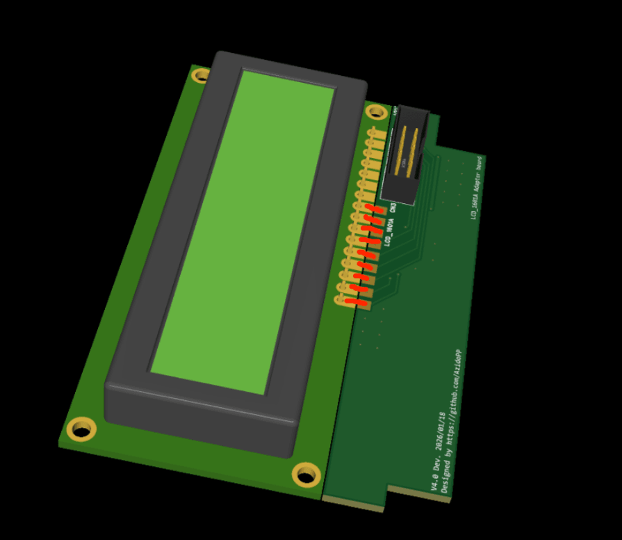
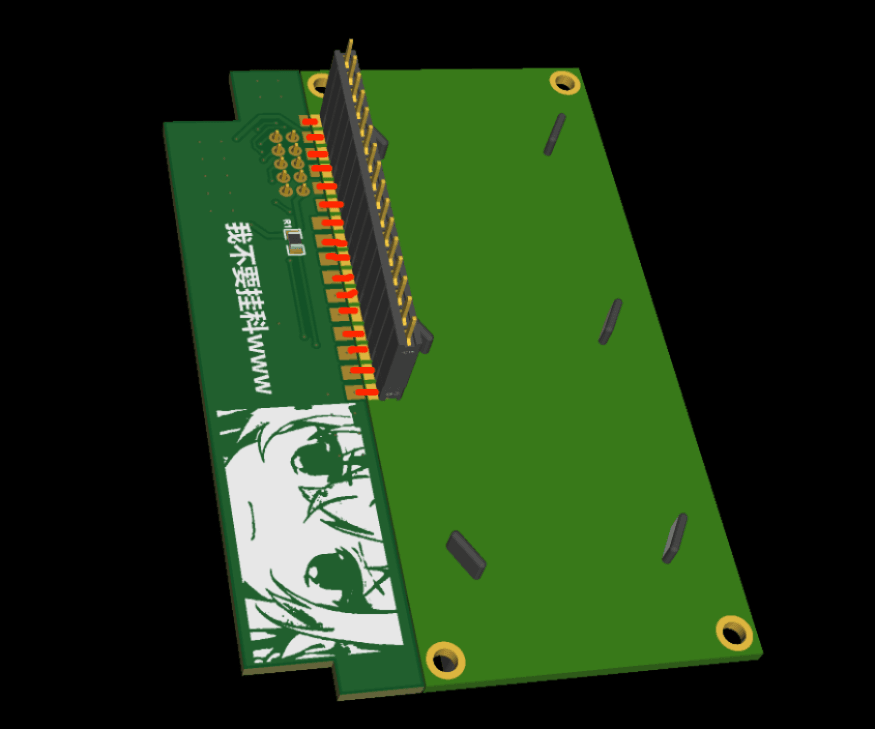

# STM-C4 Ver4.0

## 中文
基于 STM32F103C8T6 的 CS2 C4 外观模型（V4.0）。

GitHub 仓库（程序/文档）：https://github.com/AzidoPP/STM-C4  
OSHWHUB 硬件开源地址：待补充

[English](#english)

### 快速开始
1. PCB 打样
   - 主板 Gerber：[PCB_Gerber/Gerber_C4_MainBoardV4.1.zip](PCB_Gerber/Gerber_C4_MainBoardV4.1.zip)
   - LCD 转接板 Gerber：[PCB_Gerber/Gerber_LCD1601_AdapterBoardV4.0.zip](PCB_Gerber/Gerber_LCD1601_AdapterBoardV4.0.zip)
2. 采购 BOM
   - BOM 文件：[BOM/BOM.xlsx](BOM/BOM.xlsx)（或打开 [BOM/](BOM/) 选择最新）
   - 9V 电池建议使用碱性电池（输出电流更稳定）
3. 焊接与装配
   - LCD1601 转接板焊接示例（图片在 [pic/](pic/)）：
     
     
   - 3D 打印外壳/填充件：见 [3DP_Models/](3DP_Models) 与 [3DP_Models/README.md](3DP_Models/README.md)
4. 烧录固件
   - Keil 工程：[Keil_proj/c4/Project.uvprojx](Keil_proj/c4/Project.uvprojx)
   - ST-Link V2 接口位置（图片在 [pic/](pic/)）：
     
   - 引脚顺序：3.3V / SWDIO / SWCLK / GND
5. MP3 音效（可选）
   - 将 [TFCard_Files/](TFCard_Files/) 内容拷贝到 TF 卡根目录
   - 详细说明见：[TFCard_Files/README.md](TFCard_Files/README.md)
6. 常改配置（在 [Keil_proj/c4/user/config.h](Keil_proj/c4/user/config.h)）
   - 倒计时：`CONFIG_COUNTDOWN_MS`
   - 拆弹时间：`CONFIG_MANUAL_DEFUSE_MS` / `CONFIG_EXTERNAL_DEFUSE_MS`
   - 音量：`CONFIG_MP3_VOLUME`

### 基础玩法
- 上电后输入 7 位密码（默认长度由配置决定），作为“下包密码”。
- 输入完成后进入倒计时与滚动提示。
- 三种拆弹方式（均为非阻塞）：
  - 输入拆弹：再次输入与下包一致的密码即可拆弹成功。
  - 手动拆弹：长按 `#` 开始拆弹，持续到完成即成功。
  - 外部拆弹器：外部拆弹输入有效时开始拆弹，完成即成功。
- 拆弹成功会进入成功提示与蜂鸣/灯效；倒计时结束未拆弹则触发爆炸效果。

### 配置
- 配置文件：[Keil_proj/c4/user/config.h](Keil_proj/c4/user/config.h)
- 中文用户：参考 [Keil_proj/c4/user/default_config_CH.h](Keil_proj/c4/user/default_config_CH.h)
- English users: see [Keil_proj/c4/user/default_config_EN.h](Keil_proj/c4/user/default_config_EN.h)

常用配置项：
- 倒计时：`CONFIG_COUNTDOWN_MS`
- 拆弹时间：`CONFIG_MANUAL_DEFUSE_MS` / `CONFIG_EXTERNAL_DEFUSE_MS`
- 音量：`CONFIG_MP3_VOLUME`
- LCD 正装/倒装：`CONFIG_LCD_NORMAL_MOUNT`

### 详细说明
更多细节与原理说明请查看：[V4说明.md](V4说明.md)

### 免责声明
本项目为外观复刻模型，不具备任何真实功能或危险性。  
任何改装、滥用或非法使用与原作者无关，原作者不承担责任。

---

## English
An STM32F103C8T6-based CS2 C4 appearance model (V4.0).

GitHub repo (code/docs): https://github.com/AzidoPP/STM-C4  
OSHWHUB hardware link: TBD

### Quick Start
1. PCB fabrication
   - Main board Gerber: [PCB_Gerber/Gerber_C4_MainBoardV4.1.zip](PCB_Gerber/Gerber_C4_MainBoardV4.1.zip)
   - LCD adapter Gerber: [PCB_Gerber/Gerber_LCD1601_AdapterBoardV4.0.zip](PCB_Gerber/Gerber_LCD1601_AdapterBoardV4.0.zip)
2. BOM
   - BOM file: [BOM/BOM.xlsx](BOM/BOM.xlsx) (or open [BOM/](BOM/) and pick the latest)
   - Use an alkaline 9V battery for stable output current
3. Soldering & assembly
   - LCD1601 adapter examples (images in [pic/](pic/)):
     
     
   - 3D printed shell/filler: see [3DP_Models/](3DP_Models) and [3DP_Models/README.md](3DP_Models/README.md)
4. Firmware flashing
   - Keil project: [Keil_proj/c4/Project.uvprojx](Keil_proj/c4/Project.uvprojx)
   - ST-Link V2 header location (images in [pic/](pic/)):
     
   - Pin order: 3.3V / SWDIO / SWCLK / GND
5. MP3 audio (optional)
   - Copy [TFCard_Files/](TFCard_Files/) to the TF card root
   - See: [TFCard_Files/README.md](TFCard_Files/README.md)
6. Common settings (in [Keil_proj/c4/user/config.h](Keil_proj/c4/user/config.h))
   - Countdown: `CONFIG_COUNTDOWN_MS`
   - Defuse time: `CONFIG_MANUAL_DEFUSE_MS` / `CONFIG_EXTERNAL_DEFUSE_MS`
   - Volume: `CONFIG_MP3_VOLUME`

### Basic Gameplay
- Power on and enter the 7-digit password (length is configurable) as the arming code.
- After input completes, the countdown and LCD scroll start.
- Three defuse methods (non-blocking):
  - Password defuse: enter the same code again to defuse.
  - Manual defuse: long-press `#` to start defusing until completion.
  - External defuser: when the external defuser input is active, defusing starts and completes on time.
- Defuse success triggers success effects; if time runs out, the explosion effect is triggered.

### Config
- Config file: [Keil_proj/c4/user/config.h](Keil_proj/c4/user/config.h)
- 中文用户: [Keil_proj/c4/user/default_config_CH.h](Keil_proj/c4/user/default_config_CH.h)
- English users: [Keil_proj/c4/user/default_config_EN.h](Keil_proj/c4/user/default_config_EN.h)

Common settings:
- Countdown: `CONFIG_COUNTDOWN_MS`
- Defuse time: `CONFIG_MANUAL_DEFUSE_MS` / `CONFIG_EXTERNAL_DEFUSE_MS`
- Volume: `CONFIG_MP3_VOLUME`
- LCD orientation: `CONFIG_LCD_NORMAL_MOUNT`

### Detailed Docs
For full details, see: [V4说明.md](V4说明.md)

### Disclaimer
This project is a replica appearance model and has no real functionality or hazardous capability.  
Any modification, misuse, or illegal use is not associated with the original creator.
